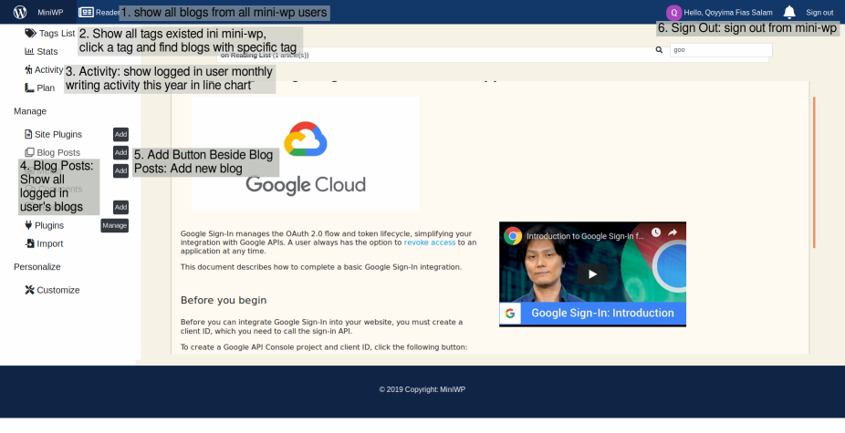

# Welcome to Mini-WP!
Write your own blog using this app! read article written by others !

## Server
### List of Blog Routes
Route | HTTP | Header(s) | Body | Description | Success Response | Failed Response
--- | --- | --- | --- | --- | --- | --- 
 / | GET | JSON web token generated while logging in (jwtoken) | none | show all blogs owned by logged in user | status code 200 and list of all logged in user's blogs | status code 401, or 500 and error message
  /all | GET | JSON web token generated while logging in (jwtoken) | none | show all blogs written by all users of mini-wp | status code 200 and list of all blogs in mini-wp | status code 401, or 500 and error message
 / | POST | JSON web token generated while logging in (jwtoken) | title (string), content(string), img (image file), author (string), tags (array of strings) | create new blog | status code 201 and JSON data of blog created | status code 400, 401, or 500 and error message
 /:id | PATCH | JSON web token generated while logging in (jwtoken) | id (string), field (string), value (depends on field) | update specific property of a document | status code 201 and update report | status code 400, 401, or 500 and error message
 /:id | PUT | JSON web token generated while logging in (jwtoken) | title (string), content(string), img (image file), author (string), tags (array of strings), id (string) | update whole properties of a document | status code 201 and update report | status code 400, 401, or 500 and error message
 /:id | DELETE | JSON web token generated while logging in (jwtoken) | id | delete a document | status code 200 and delete report | status code 401, or 500 and error message
 /tags | GET | JSON web token generated while logging in (jwtoken) | none | get list of all tags existed in mini-wp | status code 200 and list of all tags in mini-wp | status code 401, or 500 and error message
 /:tag | GET | JSON web token generated while logging in (jwtoken) | none | show all blogs matching input tag | status code 200 and list of all logged in user's blogs | status code 401, or 500 and error message
 
 ### List of User Routes
 
 Route | HTTP | Header(s) | Body | Description | Success Response | Failed Response
--- | --- | --- | --- | --- | --- | --- 
 /user/:id | GET | none | none | show one specific document of User | status code 200 and one data of User | status code 500 and error message
 /user | GET | none | none | show all documents of User | status code 200 and list of all documents of User | status code 500 and error message
 /user/register | POST | none | email (string), password (string), pp (string), name (string) | register new User | status code 201 and document of created User | status code 400, or 500 and error message
 /user/login | POST | none | email, password | log in into application | status code 200 and JSON web token | status code 400, or 500 and error message
 /user/update | PUT | none | id, email, password, pp | update property of a document User | status code 200 and update report | status code 500 and error message
 /user/delete | DELETE | none | id | delete one document of User | status code 200 and delete report | status code 500 and error message
 
 ## Client
 Here's an image of deployed app, showing which can be accessed and which can't.

 
 ## Usage
Make sure you have node.js installed on your computer and then run these commands :
    $ npm install
and then go to server directory, and :
    $ npm run start
 
access the API via http://35.186.159.16//<*--choose from list 

access deployed app in http://mini-wp.qfs-hacktiv8.com/
